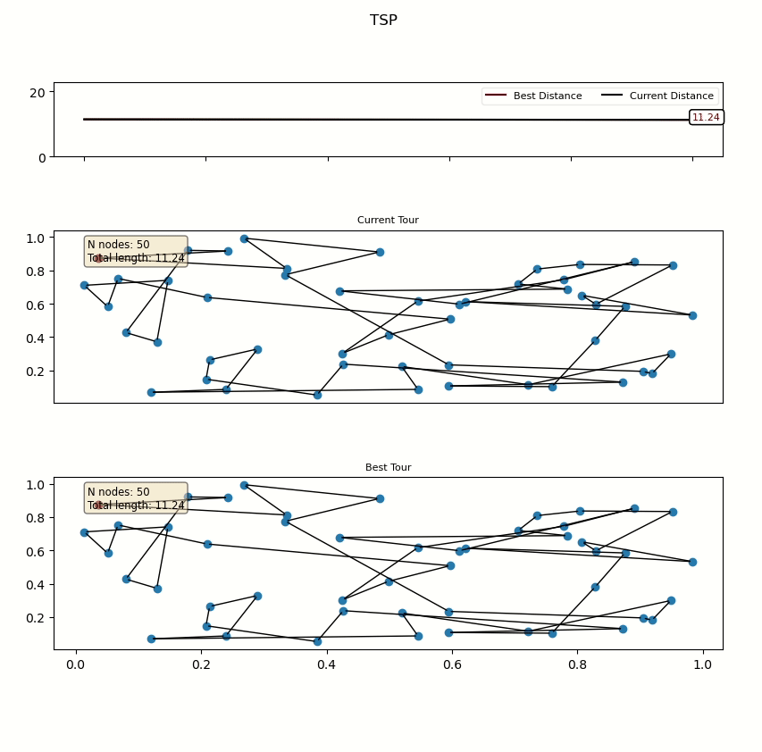

# Learning 2-opt Heuristics for the TSP via Deep Reinforcement Learning [](https://twitter.com/intent/tweet?text=Learning%20to%20perform%202-opt%20heuristics%20with%20DRL&url=https://github.com/paulorocosta/learning-2opt-drl&hashtags=tsp,2opt,ai,rl)


Implementation of the Policy Gradient algorithm for learning 2-opt improvement heuristics, following: 
http://proceedings.mlr.press/v129/costa20a/costa20a.pdf

https://arxiv.org/abs/2004.01608 

Dependencies: 
- Python 3.6.4
- Torch
- Numpy
- Matplotlib
- Apex
- tqdm
- pyconcorde


## How to train it?

To train the model you can run:

For TSP instances with 20 nodes:
```
python PGTSP20.py
```
For TSP instances with 50/100 nodes (default 50 nodes):
```
python PGTSP50_100.py
```

## How to test it?

To use the learned polcies reported in the paper you can run:
```
python TestLearnedAgent.py --load_path best_policy/policy-TSP20-epoch-189.pt --n_points 20 --test_size 1 --render 
```
where ``` load_path ``` can be replaced with one of the policies in /best_policy. 

## Results

Learned policy on a TSP with 50 nodes:


